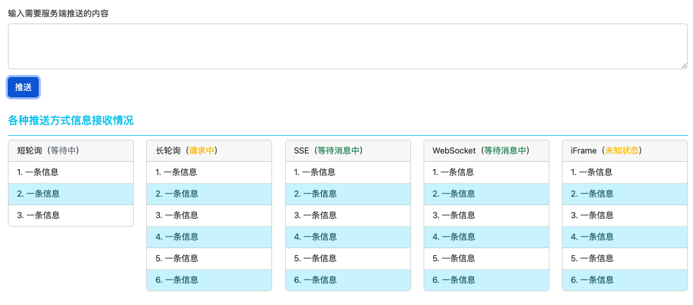

# 服务端推送方式整理

> **仅针对Web前端来看**
> 
> 详细可以查看：[https://mp.weixin.qq.com/s/XewrHKy6zzM9xyW3KHy1Xg](https://mp.weixin.qq.com/s/XewrHKy6zzM9xyW3KHy1Xg)

## 跑测试代码

- 使用`yarn dev`启动测试服务器
- 通过浏览器访问[http://localhost:3000](http://localhost:3000)

## 主要推送方式

- 短轮询
- 长轮询
- SSE
- WebSocket
- iFrame

